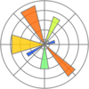

# Welcome
I make sustainable change happen by elevating computational methods and a data-driven approach.
- LCA data pipelines
- Component plug-ins
- Single-page applications

## Focus
- Scraping techniques
- API programming
- Text processing
- IPC scripting

### Tools
  
*Scientific Computing*  
  
&nbsp;&nbsp;&nbsp;&nbsp; &nbsp;&nbsp;&nbsp;&nbsp; &nbsp;&nbsp;&nbsp;&nbsp; &nbsp;&nbsp;&nbsp;&nbsp;   
  
*Full-stack Development*  
  
&nbsp;&nbsp;&nbsp;&nbsp; &nbsp;&nbsp;&nbsp;&nbsp; 
